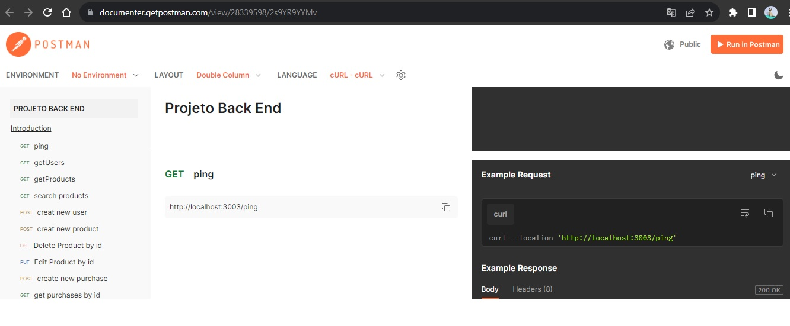
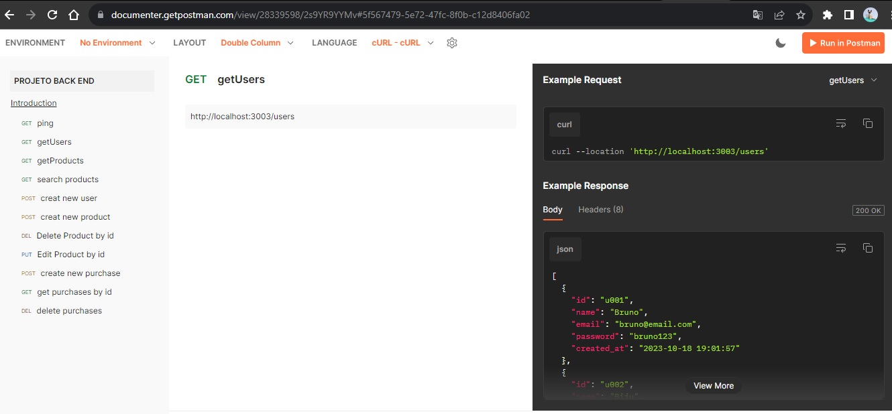
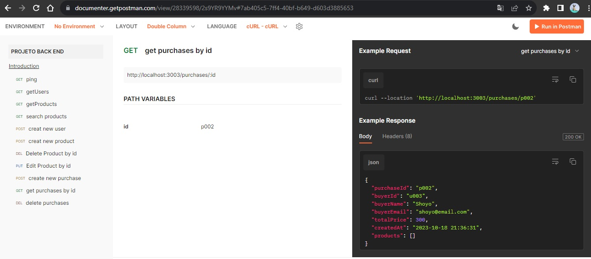
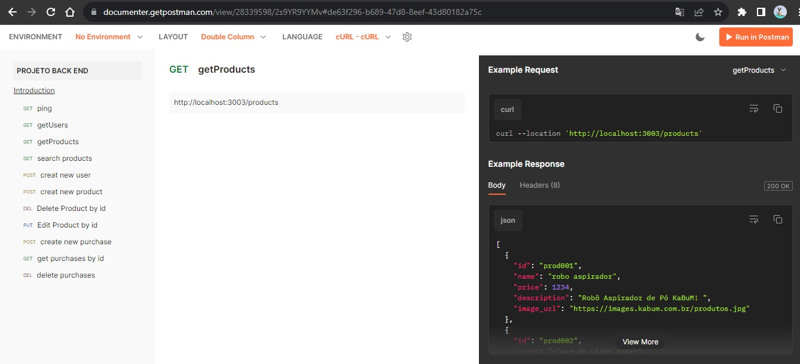
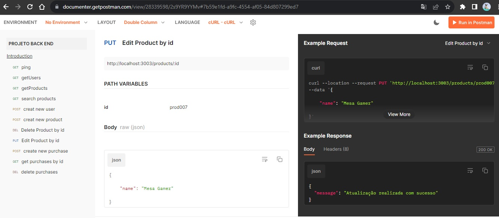
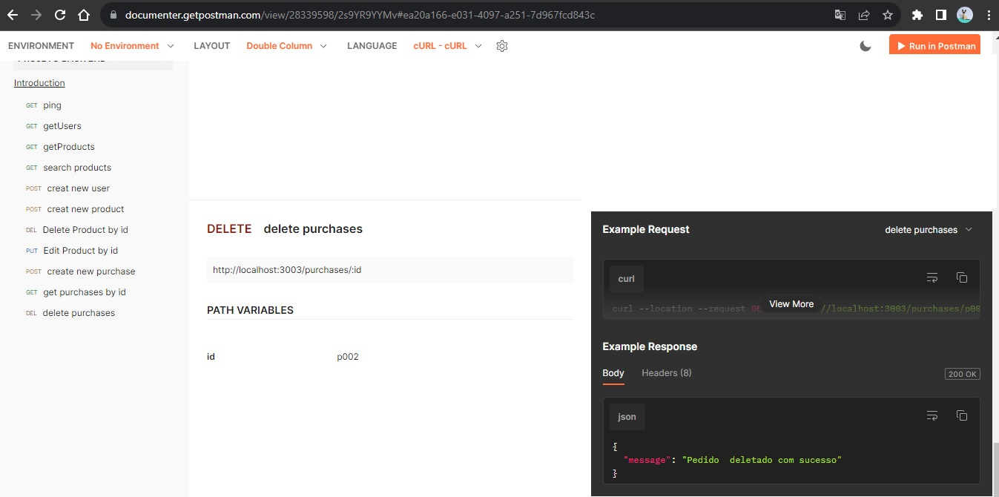
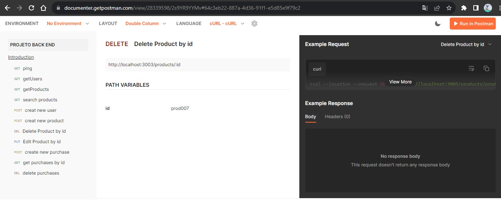
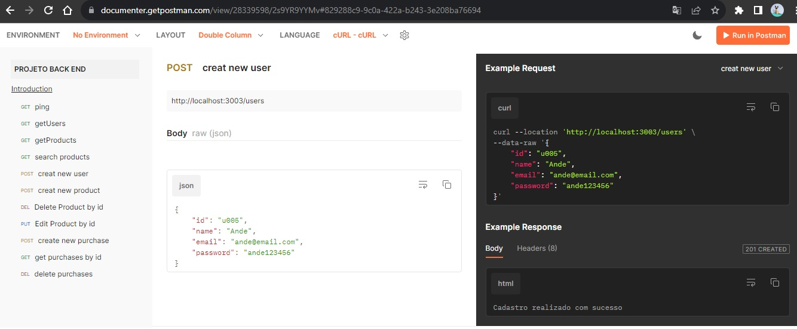
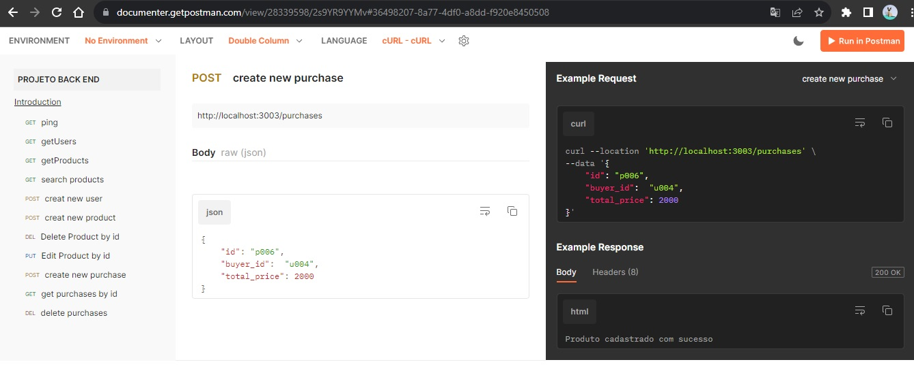
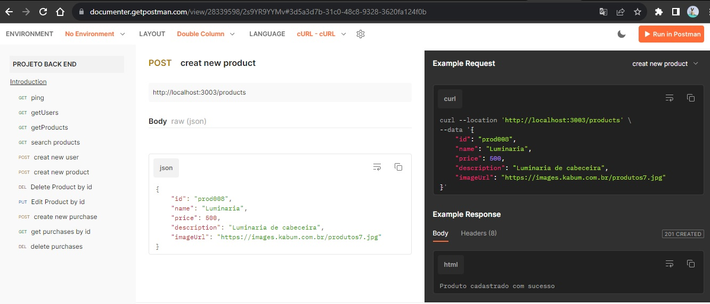

# labecommerce-backend

# Projeto SQL - Gestão de Dados

Este projeto consiste em um conjunto de instruções SQL para criar, manipular e gerenciar dados em um banco de dados. O SQL é usado para criar tabelas, inserir registros, realizar consultas e fazer modificações nos dados.

## Tabelas

O projeto envolve três tabelas principais:

### Tabela de Usuários

```sql
CREATE TABLE users (
    id TEXT PRIMARY KEY UNIQUE NOT NULL,
    name TEXT NOT NULL,
    email TEXT UNIQUE NOT NULL,
    password TEXT NOT NULL,
    created_at DATETIME DEFAULT (strftime('%Y-%m-%d %H:%M:%S', 'now', 'localtime'))
);
```

### Tabela de Produtos

```sql
CREATE TABLE products (
    id TEXT PRIMARY KEY UNIQUE NOT NULL,
    name TEXT NOT NULL,
    price REAL NOT NULL,
    description TEXT NOT NULL,
    image_url TEXT NOT NULL
);
```

### Tabela de Compras

```sql
CREATE TABLE purchases (
    id TEXT PRIMARY KEY UNIQUE NOT NULL,
    buyer_id TEXT NOT NULL,
    total_price REAL NOT NULL,
    product_id TEXT,
    product_description TEXT,
    created_at DATETIME DEFAULT (strftime('%Y-%m-%d %H:%M:%S', 'now', 'localtime')),
    FOREIGN KEY (buyer_id) REFERENCES users(id) ON UPDATE CASCADE ON DELETE CASCADE,
    FOREIGN KEY (product_id) REFERENCES products(id) ON UPDATE CASCADE ON DELETE CASCADE
);
```

### Tabela de Relações entre Compras e Produtos

```sql
CREATE TABLE purchases_products (
  purchase_id TEXT NOT NULL,
  product_id TEXT NOT NULL,
  quantity INTEGER NOT NULL,
  FOREIGN KEY (purchase_id) REFERENCES purchases (id) ON UPDATE CASCADE ON DELETE CASCADE,
  FOREIGN KEY (product_id) REFERENCES products (id) ON UPDATE CASCADE ON DELETE CASCADE
);
```

## Consultas

O projeto inclui consultas SQL para realizar operações diversas, como seleção, exclusão e atualização de dados. Algumas das consultas realizadas são:

- Selecionar todos os usuários
```sql
SELECT * FROM users;
```

- Excluir a tabela de usuários
```sql
DROP TABLE users;
```

- Inserir novos usuários
```sql
INSERT INTO users (id, name, email, password) VALUES (...);
```

- Selecionar todos os produtos
```sql
SELECT * FROM products;
```

- Excluir a tabela de produtos
```sql
DROP TABLE products;
```

- Inserir novos produtos
```sql
INSERT INTO products (id, name, price, description, image_url) VALUES (...);
```

- Buscar produtos por nome
```sql
SELECT * FROM products WHERE name LIKE ;
```

- Excluir usuário por ID
```sql
DELETE FROM users WHERE id = id;
```

- Excluir produto por ID
```sql
DELETE FROM products WHERE id = id;
```

- Editar produto por ID
```sql
UPDATE products SET ... WHERE id = id;
```

- Inserir pedidos de compra
```sql
INSERT INTO purchases (id, buyer_id, total_price, product_id, product_description) VALUES (...);
```

- Editar pedido de compra
```sql
UPDATE purchases SET total_price = $$ WHERE buyer_id = id;
```

## Junção de Tabelas

O projeto também demonstra como realizar junção de tabelas para obter informações de várias tabelas. Um exemplo de junção de tabelas é:

```sql
SELECT purchases.id AS idCompra, users.id AS idUser, users.name, users.email, purchases.total_price, purchases.created_at
FROM purchases
INNER JOIN users ON users.id = purchases.buyer_id;
```

## Tabela de Relações entre Compras e Produtos

Além disso, o projeto demonstra como criar uma tabela de relações entre compras e produtos e realizar operações nessa tabela. Alguns exemplos de operações estão incluídos no código SQL.

## Licença

O projeto está disponível sob a https://documenter.getpostman.com/view/28339598/2s9YR9YYMv License.
```










